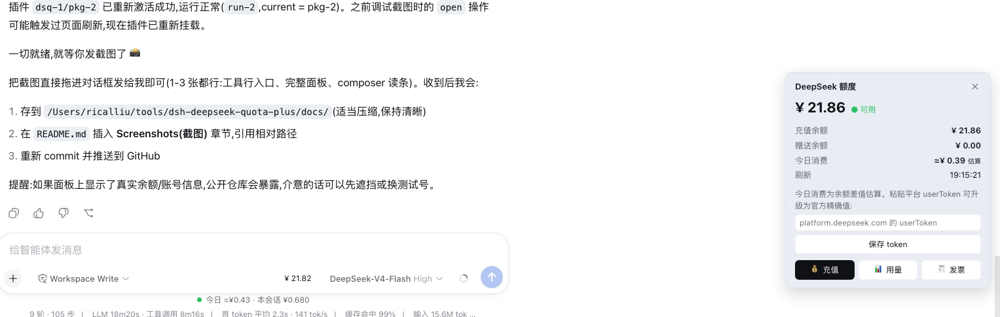

# 💰 dsh-deepseek-quota-plus

DeepSeek API 额度插件(DSH Web 版):余额、今日消费、当前会话费用,一体化 UI。

A DeepSeek Harness (DSH) web GUI plugin showing your DeepSeek API **balance**, **today's consumption** and the **current conversation cost**, with a UI integrated into the input toolbar (official theme tokens, light/dark aware).

| Balance | Today's consumption | Conversation cost | Links |
| --- | --- | --- | --- |
| Total / granted / topped-up, availability | Official (platform) or balance-delta estimate | Real-time pricing + full log replay | Top-up / usage / invoice |

## ✨ Features

- **输入工具行入口**:余额徽标按钮(悬停才显示背景,低调不抢眼),与模型选择同排。
- **常驻读条**:输入框下方一行 `今日 ≈¥x.xx · 本会话 ¥x.xxx`。
- **完整面板**:总余额/充值余额/赠送余额、可用状态、今日消费(标注 `官方`/`估算` 来源)、本会话费用、刷新时间。
- **一键跳转**:💰 充值 → `platform.deepseek.com/top_up`、📊 用量 → `/usage`、🧾 发票 → `/billing`。
- **官方精确消费**:在面板粘贴平台 `userToken`(经 credentials 服务持久化为 `DEEPSEEK_PLATFORM_TOKEN`),今日消费即走平台 dashboard 接口,显示"官方"。
- **会话费用公式**:悬停查看 `输入/缓存命中/输出 tokens × 单价 = 小计`(按消息时刻官方价格表计价,含峰谷)。
- **零配置**:自动读取 DSH 的 `DEEPSEEK_API_KEY` 凭证(与模型提供商共用)。
- **跟随主题**:全部使用 `--dsw-alias-*` 官方 token,明暗自适应。

## 🖼 Screenshots



## 📥 Install

Requires the DSH CLI and [pnpm](https://pnpm.io/installation).

```sh
dsh plugin --profile web add github:RicalLiu/dsh-deepseek-quota-plus
```

Restart the web app (`dsh web`), then open http://127.0.0.1:3080 and refresh.

> Manual alternative: install the package into the profile's `node_modules` and add a loader entry to `~/.dsh/profiles/web/cordis.patch.yml`:
>
> ```yaml
> - insert:
>     - id: deepseek-quota-plus
>       name: dsh-deepseek-quota-plus
> ```

## ⚙️ Configuration

- **API Key**: read automatically from `DEEPSEEK_API_KEY` (set on **Settings → Models**, or export in the launching environment). No manual entry needed.
- **Platform token (optional, for official today's consumption)**:
  1. Log in to [platform.deepseek.com](https://platform.deepseek.com).
  2. Open DevTools → Console, run: `JSON.parse(localStorage.getItem('userToken')).value`
  3. Paste it into the plugin panel (💰 → "保存 token"), or store it manually as `DEEPSEEK_PLATFORM_TOKEN` in `~/.dsh/.credentials.yaml`.

Without the token, today's consumption falls back to a balance-delta estimate (shown with a `≈` prefix and labeled "估算").

## 🏗 Architecture

| Part | File | What it does |
| --- | --- | --- |
| Host half | `lib/index.js` | Cordis plugin registering `GET /api/deepseek-balance`, `GET /api/deepseek-session-cost` and `POST /api/deepseek-set-platform-token`; subscribes `session/event` to price every `assistant/message`. |
| Pricing | `lib/pricing.js` | Official DeepSeek price-table engine (policy timeline + peak/off-peak), ported from [dsh-web-billing](https://github.com/bpc-oss/dsh-web-billing) (MIT). |
| Browser half | `lib/client.js` | `dsh.client` web bundle registering the toolbar entry, composer-dock readout and overlay panel. |
| Composition | `cordis.patch.yml` | The `dsh.bundle` patch layer that inserts the loader entry. |

### Data sources

1. **Balance** — official `GET https://api.deepseek.com/user/balance` (with `DEEPSEEK_API_KEY`).
2. **Today's consumption, official** — platform dashboard `platform.deepseek.com/api/v0/usage/cost?month=&year=` (with `DEEPSEEK_PLATFORM_TOKEN`). Private endpoint; may change without notice.
3. **Today's consumption, estimate** — balance delta (`max(0, day-opening − current)`), persisted to `$DSH_HOME/storages/deepseek-quota-day.json`.
4. **Conversation cost** — every `assistant/message` priced with the official table; the whole conversation is replayed from its persisted log, so the figure includes history from before the plugin was installed.

## 🔒 Security

- The API key / platform token never leaves your machine: the browser only talks to local routes the host half registers.
- Tokens are stored through the DSH credentials service, never echoed back to the UI.

## 🙏 Credits

- [dsh-deepseek-quota](https://github.com/yingjunnan/dsh-deepseek-quota) (MIT) — the original balance widget this project reworks; network layer, session-cost replay and daily-meter logic derive from it.
- [dsh-web-billing](https://github.com/bpc-oss/dsh-web-billing) (MIT) — official pricing engine.
- [dsh-balance-plugin](https://github.com/Francis-Xavier-code/dsh-balance-plugin) — input-toolbar entry layout inspiration.

Full third-party attribution is documented in [NOTICE](NOTICE); project contributors are listed in [AUTHORS](AUTHORS).

## 📄 License

MIT
